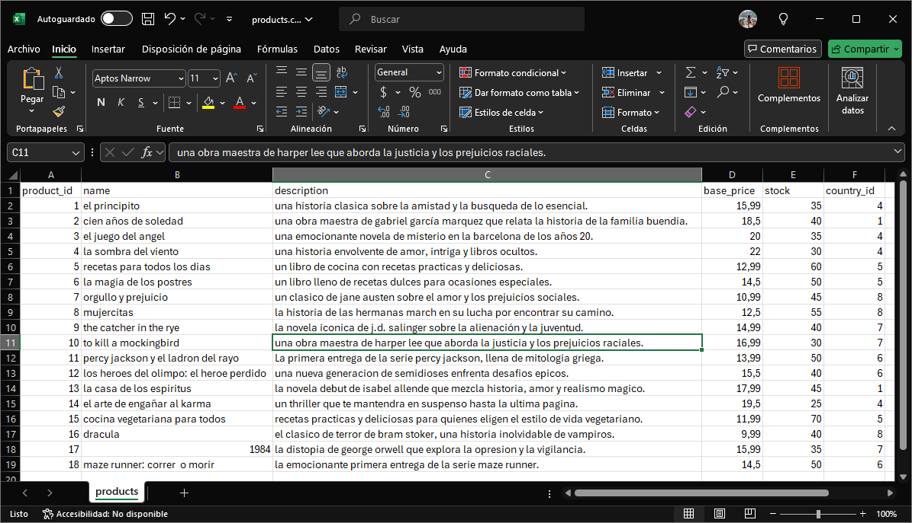
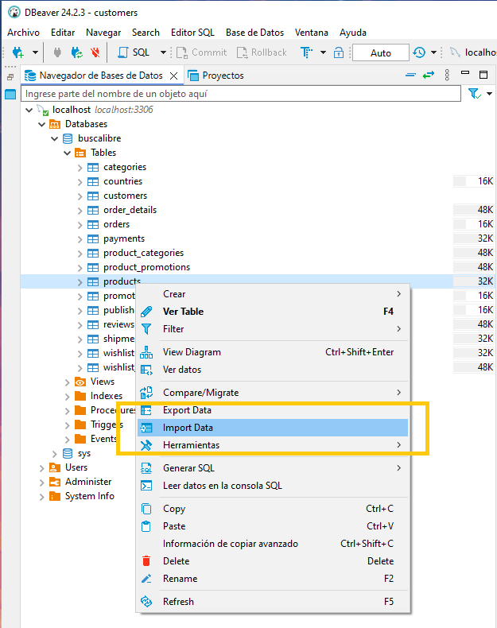
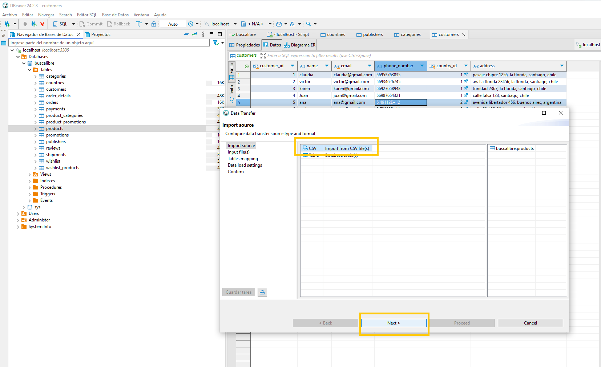
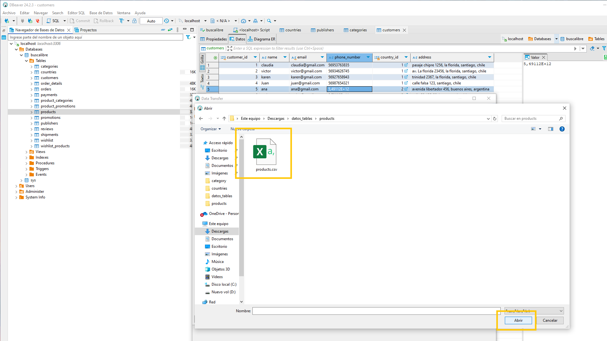
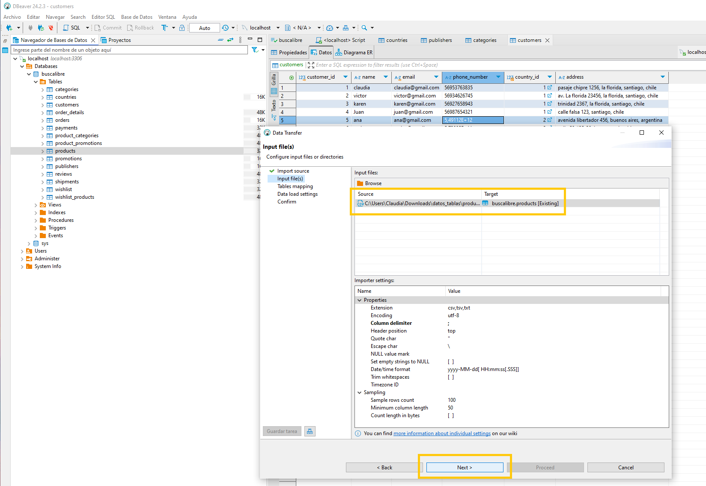
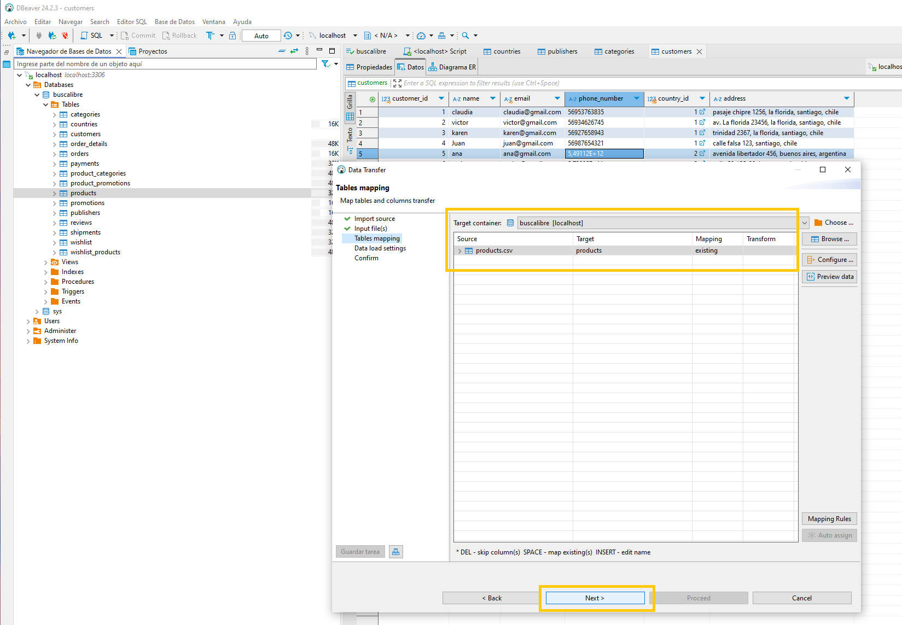
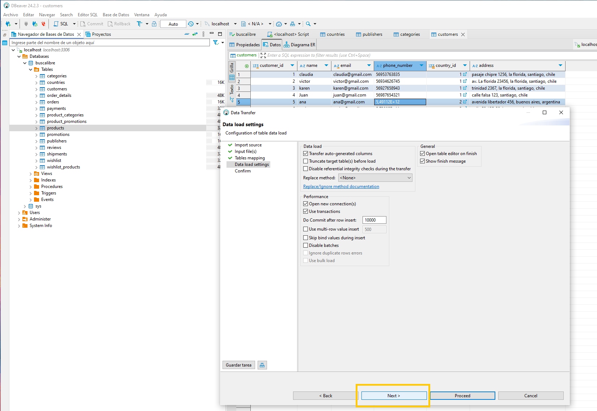
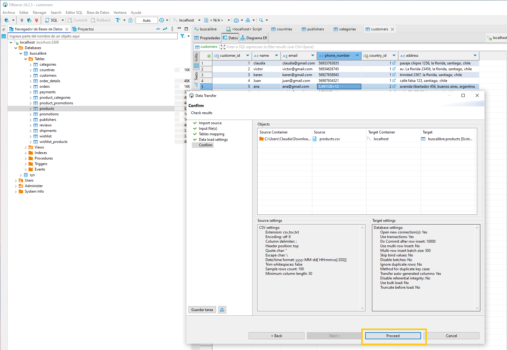
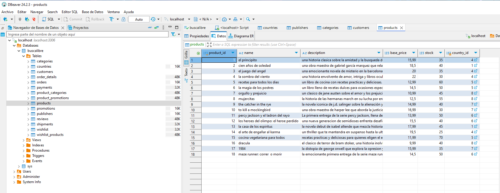

# SQL_Entrega1
Simulación de base de datos de tienda virtual Buscalibre.

# Proyecto de Base de Datos para Plataforma de Comercio Electrónico

## Descripción General
Este proyecto define una base de datos relacional en MySQL diseñada para gestionar una plataforma de comercio electrónico similar a **Buscalibre**. 

La plataforma se especializa en la venta de libros, productos electrónicos, juegos de mesa y otros artículos provenientes de diferentes partes del mundo, ofreciendo envíos a domicilio tanto dentro de Chile como a otros países. Además, es reconocida por su amplia variedad de títulos y por facilitar la importación de productos difíciles de encontrar en el mercado local.

La base de datos organiza información clave sobre clientes, productos, categorías, pedidos, promociones, envíos, pagos y más, asegurando integridad referencial y escalabilidad.

---

## Estructura de Tablas

### 1. Countries
Guarda información de los países en los que opera la plataforma.
- **Campos:**
  - `CountryID`: Identificador único (PK).
  - `Name`: Nombre del país.
  - `Currency`: Moneda del país.
  - `Language`: Idioma principal.
  - `TaxRate`: Tasa de impuestos aplicada.

### 2. Publishers
Registra a las editoriales como proveedores.
- **Campos:**
  - `PublisherID`: Identificador único (PK).
  - `Name`: Nombre de la editorial.
  - `ContactEmail`: Correo de contacto.
  - `PhoneNumber`: Número de teléfono.
  - `Address`: Dirección de la editorial.

### 3. Categories
Define las categorías de los productos.
- **Campos:**
  - `CategoryID`: Identificador único (PK).
  - `Name`: Nombre de la categoría.

### 4. Customers
Almacena la información de los clientes.
- **Campos:**
  - `CustomerID`: Identificador único (PK).
  - `Name`: Nombre del cliente.
  - `Email`: Correo electrónico (único).
  - `PhoneNumber`: Número de teléfono.
  - `CountryID`: FK hacia `Countries`.
  - `Address`: Dirección del cliente.

### 5. Products
Gestiona los productos que se ofrecen en la plataforma.
- **Campos:**
  - `ProductID`: Identificador único (PK).
  - `Name`: Nombre del producto.
  - `Description`: Descripción del producto.
  - `BasePrice`: Precio base.
  - `Stock`: Cantidad disponible.
  - `CountryID`: FK hacia `Countries` (país de origen o distribución).

### 6. Promotions
Administra las promociones activas en la plataforma.
- **Campos:**
  - `PromotionID`: Identificador único (PK).
  - `Name`: Nombre de la promoción.
  - `DiscountPercentage`: Porcentaje de descuento.
  - `StartDate`: Fecha de inicio.
  - `EndDate`: Fecha de finalización.

### 7. Reviews
Permite a los clientes dejar reseñas sobre los productos.
- **Campos:**
  - `ReviewID`: Identificador único (PK).
  - `CustomerID`: FK hacia `Customers`.
  - `ProductID`: FK hacia `Products`.
  - `Rating`: Calificación (1-5).
  - `Comment`: Comentario del cliente.
  - `ReviewDate`: Fecha de la reseña.

### 8. Orders
Registra los pedidos realizados por los clientes.
- **Campos:**
  - `OrderID`: Identificador único (PK).
  - `CustomerID`: FK hacia `Customers`.
  - `OrderDate`: Fecha del pedido.
  - `TotalAmount`: Monto total.

### 9. Shipments
Rastrea los envíos asociados a los pedidos.
- **Campos:**
  - `ShipmentID`: Identificador único (PK).
  - `OrderID`: FK hacia `Orders`.
  - `ShipmentDate`: Fecha de envío.
  - `TrackingNumber`: Número de rastreo.
  - `Status`: Estado del envío.

### 10. Payments
Guarda los detalles de los pagos realizados por los pedidos.
- **Campos:**
  - `PaymentID`: Identificador único (PK).
  - `OrderID`: FK hacia `Orders`.
  - `PaymentDate`: Fecha de pago.
  - `Amount`: Monto pagado.
  - `PaymentMethod`: Método de pago.

### 11. Wishlist
Permite a los clientes guardar productos como favoritos.
- **Campos:**
  - `WishlistID`: Identificador único (PK).
  - `CustomerID`: FK hacia `Customers`.

---

## Tablas Intermedias

### 1. ProductCategories
Relaciona productos con categorías (muchos a muchos).
- **Campos:**
  - `ProductCategoryID`: Identificador único (PK).
  - `ProductID`: FK hacia `Products`.
  - `CategoryID`: FK hacia `Categories`.

### 2. WishlistProducts
Asocia productos a listas de deseos (muchos a muchos).
- **Campos:**
  - `WishlistProductID`: Identificador único (PK).
  - `WishlistID`: FK hacia `Wishlist`.
  - `ProductID`: FK hacia `Products`.

### 3. ProductPromotions
Vincula productos con promociones (muchos a muchos).
- **Campos:**
  - `ProductPromotionID`: Identificador único (PK).
  - `ProductID`: FK hacia `Products`.
  - `PromotionID`: FK hacia `Promotions`.

### 4. OrderDetails
Registra los productos comprados en cada pedido.
- **Campos:**
  - `OrderDetailID`: Identificador único (PK).
  - `OrderID`: FK hacia `Orders`.
  - `ProductID`: FK hacia `Products`.
  - `Quantity`: Cantidad de productos.
  - `PriceAtPurchase`: Precio al momento de la compra.

---

## Relaciones Principales
1. **Customers ↔ Countries:** Un cliente pertenece a un país.
2. **Customers ↔ Reviews:** Un cliente puede realizar muchas reseñas.
3. **Reviews ↔ Products:** Un producto puede tener muchas reseñas.
4. **Publishers ↔ Products:** Una editorial puede proveer muchos productos.
5. **Categories ↔ Products:** Las categorías contienen muchos productos.
6. **Wishlist ↔ Customers:** Un cliente tiene una lista de deseos.
7. **Products ↔ Orders:** Muchos productos pueden estar en muchas órdenes.
8. **Orders ↔ Shipments:** Una orden puede tener muchos envíos.
9. **Orders ↔ Payments:** Una orden tiene un pago.
10. **Promotions ↔ Products:** Muchas promociones pueden aplicarse a un producto.

---

## Diagrama Relacional

# SQL_Entrega2

## Views

### 1. v_top_products
Lista los productos con mayor cantidad de ventas y sus detalles.
  - Objetivo: Facilitar el análisis de los productos más vendidos.
  - Tablas Compuestas: products, order_details.

### 2. v_top_rated_books
Esta vista muestra los libros con mejor calificación promedio basados en las reseñas de los usuarios.
  - Objetivo: Ayuda a identificar los libros más populares entre los clientes, lo cual es útil para promociones.
  - Tablas Compuestas: products, reviews.

### 3. v_sales_summary
Esta vista resume las ventas realizadas, mostrando el total de ingresos generados y el número de productos vendidos por pedido.
  - Objetivo: Ofrece un resumen de las ventas totales para analizar el rendimiento comercial.
  - Tablas Compuestas: orders, order_details.

### 4. v_customer_wishlists
Muestra las listas de deseos de los clientes, junto con los productos agregados a cada lista.
  - Objetivo: Permite a los administradores conocer las preferencias de los clientes y planificar inventarios o promociones.
  - Tablas Compuestas: customers, wishlist, wishlist_products, products.

### 5. v_promotions_active
Muestra todas las promociones activas, junto con los productos que están incluidos en ellas.
  - Objetivo: Facilita la identificación de promociones vigentes y sus productos relacionados para campañas de marketing.
  - Tablas Compuestas: promotions, product_promotions, products.

### 6. v_shipments_status
Muestra un resumen del estado de los envíos realizados, junto con la fecha y el número de seguimiento.
  - Objetivo: Proporciona un informe sobre el estado actual de los envíos para mejorar la logística.
  - Tablas Compuestas: shipments, orders, customers.

### 7. v_country_tax_rates
Muestra la tasa de impuestos de cada país y los productos asociados que pertenecen a esos países.
  - Objetivo: Es útil para calcular el precio total de los productos con impuestos incluidos según su país de origen.
  - Tablas Compuestas: countries, products.

## Functions

### 1. get_product_count_by_category
Devuelve el número total de productos asociados a una categoría específica.
  - Objetivo: Identificar cuántos productos pertenecen a una categoría dada.
  - Tablas Compuestas: products, product_categories, categories.

### 2. get_total_sales_by_customer
Calcula el total de dinero gastado por un cliente específico en función de sus pedidos.
  - Objetivo: Obtener el monto total de ventas asociadas a un cliente para análisis de ingresos o comportamiento.
  - Tablas Compuestas: orders, order_details.

## Stored Procedure

### 1. sp_create_promotion
Permite agregar una nueva promoción a la tabla promotions, con un porcentaje de descuento y un rango de fechas.
  - Objetivo: Crear una nueva promoción con el nombre, porcentaje de descuento, fecha de inicio y fecha de finalización.
  - Tablas Compuestas: promotions.

### 2. sp_sales_report
Obtiene un informe de ventas de productos, mostrando el total vendido de cada producto.
  - Objetivo: Generar un informe de ventas, mostrando el nombre del producto, la cantidad total vendida y los ingresos totales generados por cada producto.
  - Tablas Compuestas: order_details, products.

## Triggers

### 1. trg_update_total_amount
Actualiza automáticamente el campo total_amount en la tabla orders cada vez que se inserta, actualiza o elimina un detalle de pedido en la tabla order_details.
  - Objetivo: Mantener sincronizado el total del pedido con los detalles asociados, calculando la suma total en tiempo real.
  - Tablas Compuestas: orders, order_details.

### 2. trg_reduce_stock
Reduce automáticamente el stock disponible de un producto en la tabla products cuando se inserta un nuevo detalle en order_details.
  - Objetivo: Controlar y actualizar el inventario en tiempo real para evitar inconsistencias.
  - Tablas Compuestas: products, order_details.

## Proceso detallado de inserción de datos en tablas

